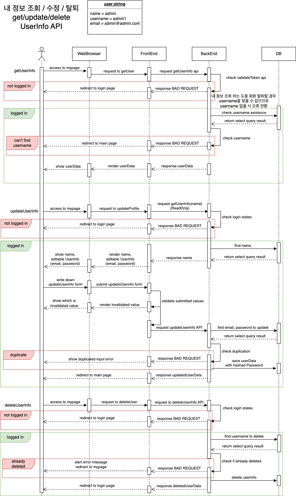

# StarRoad - 국내 여행지 추천 서비스


## 당신의 여정을 함께할게요!

<br>

# ❓서비스 소개

```jsx
Star_Road - 국내 여행지 추천 서비스
'StarRoad와 함께하세요'
```

<br>
<br>

# 🥰 멤버

|                   Frontend                   | Frontend | Frontend | Frontend | Backend  | Backend  |
| :------------------------------------------: | :------: | :------: | :------: | :------: | :------: |
|                                              |
| [[팀장\_최현준](https://github.com/solssak)] | [양영조] | [김채영] | [권희경] | [김희산] | [김승환] |

<br>
<br>

# ⚙️ 기술스택

### 🧷 프론트엔드

<div align="middle">


**Language |** JavaScript

**Framework |** React

**Library |** Axios, Tailwind, Zustand

<br>
<br>

</div>

### 🧷 백엔드

<div align="middle">


**Language |** TypeScript

**Framework |** Express

**Data(RDBMS) |** MySQL + GCP

</div>
<br>
<br>

## BackEnd Features

- 유저 관련 API / 일정 생성, 게시글, 댓글 관련 API / 관광지 API
- 카카오, 구글 OAuth 인증 구현
- multer를 이용한 이미지 업로드 기능
- 응답시간 미들웨어
- 쉬운 사용 위한 JSDOC 주석을 위한 툴팁 작성 ./src/types/controller.d.ts
  https://gist.github.com/sh5080/c8dbcd35abb8c8b5dea46fcb6644beb7

- **API 명세서 |** https://documenter.getpostman.com/view/26758081/2s93m91MNe
- **Sequence Diagram Example |**
  

# 👉 시작 가이드

## Requirements

For building and running application you need:

- Node.js 18.16.0
- Yarn 1.22.19
- Typescript 5.1.3

## Installation

```Installation
$ git clone https://github.com/elice-starRoad/Frontend
$ git clone https://github.com/elice-starRoad/Backend
$ cd starRoad
```

## Backend

```Backend
$ yarn && yarn start
```

## Frontend

```Frontend
$ npm install && npm run dev
```

# 🔥 전체 기능 소개

## 1. 구글, 카카오 간편 로그인

    구글, 카카오 로그인으로 쉽게 로그인할 수 있어요


<br>

## 2. 여행지 검색 및 일정 생성

    날짜를 선택하고 장소를 추가하면 여행리스트를 생성해요
    각 장소별 상세 정보도 확인할 수 있어요!


<br>

## 3. 여행지 경로 확인

    선택한 경로의 대략적인 이동시간도 확인 가능해요


<br>

## 4. 여행기 조회

    다른 사람들이 다녀온 여행지 상세 경로와 후기를 볼 수 있고 댓글 기능을 통해 커뮤니케이션을 할 수 있어요


### 여행기 상세 보기


<br>
